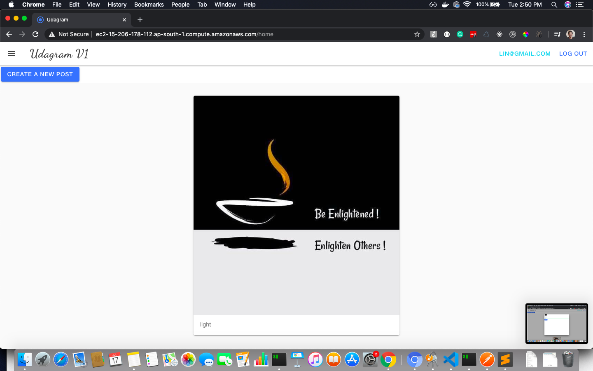
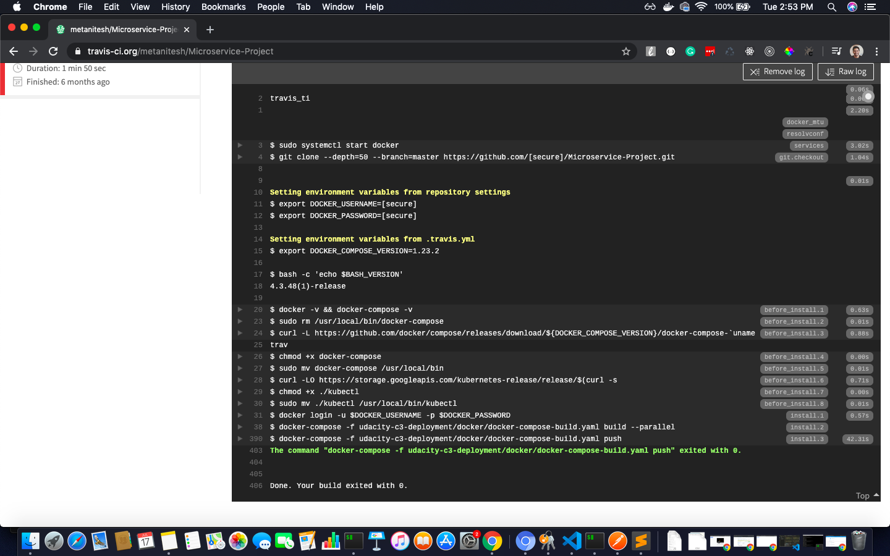
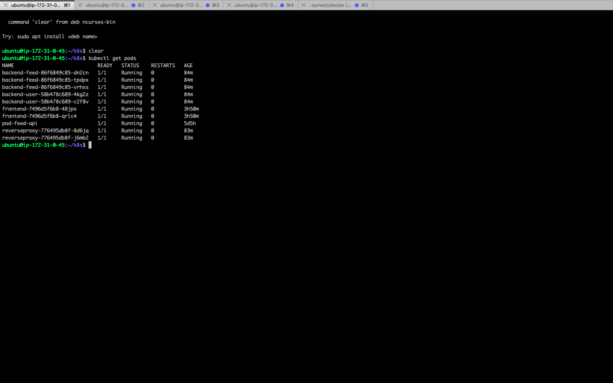
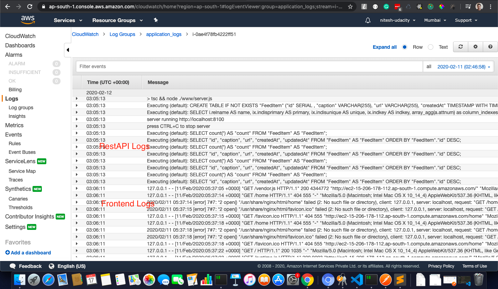

# Microservice-Project
This is the project 3 submission repository for Udacity Cloud developer Nanodegree. 

Github Link-
https://github.com/metanitesh/Microservice-Project

CI link- 
https://travis-ci.org/metanitesh/Microservice-Project

DockerHub-
https://hub.docker.com/u/metanitesh

Starting the app in local system -
- checkout the GitHub repo
- Cd to udacity-c3-deployment/docker 
- docker-compose up

Deployed Verison of App:
http://ec2-15-206-178-112.ap-south-1.compute.amazonaws.com/

Rolling update:
kubectl apply -f "udacity-c3-deployment/k8s/backend-feed-deployment.yaml/"

Deployed screenshot

CI screenshot


Kubernetes running pods screeshots

CloudWatch screenshot

